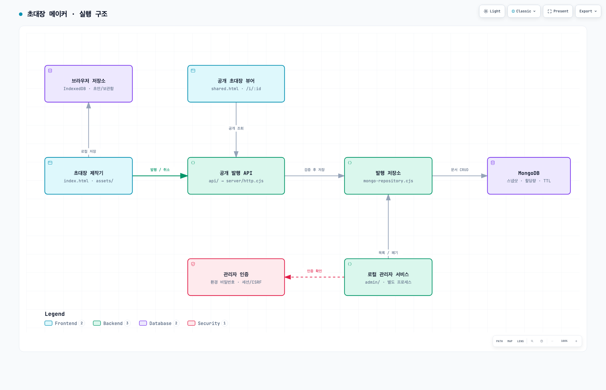

# 초대장 메이커

브라우저에서 초대장을 만들고, 독립 HTML로 저장하거나 공개 링크로 발행할 수 있는 정적 우선 초대장 제작기입니다. 제작 데이터는 브라우저에 보관하고, 공개 발행을 선택한 경우에만 정규화된 초대장 스냅샷을 MongoDB에 저장합니다.

## 제공 기능

- 생일, 결혼, 기념일, 행사 등 행사별 템플릿 선택
- 실시간 미리보기와 독립 실행형 HTML 다운로드
- 사진을 Base64/WebP로 포함한 단일 HTML export
- 브라우저 IndexedDB 기반 초안 및 로컬 초대장 보관
- Base62 공개 ID를 사용하는 익명 초대장 발행
- 발행 초대장 조회 및 제작자 토큰 기반 삭제
- 로컬 관리자 서비스의 목록, 검색, 페이지네이션, 상세, 강제 폐기
- GA4/PostHog 선택적 분석 설정

## 서비스 구조



[Archify 인터랙티브 구조도](docs/architecture/archify/system.html) · [원본 JSON과 재생성 방법](docs/architecture/archify/README.md)

```text
초대장 메이커
├── 제작기        index.html + assets/
├── 공개 뷰어      shared.html
├── 공개 API       api/ + server/
├── 로컬 관리자    admin/
├── 공개 산출물    public/
└── 문서/설계      docs/
```

자세한 경계와 리팩토링 진척은 [`docs/architecture/README.md`](docs/architecture/README.md)를 참고하세요. 계획했던 리팩토링은 5단계 모두 코드에 반영되어 완료되었습니다. 원본 Mermaid 다이어그램은 [`docs/architecture/diagrams/`](docs/architecture/diagrams/)에 있습니다.

## 빠른 시작

Node.js 22 이상을 사용합니다.

```bash
npm ci
cp .env.example .env
npm start
```

제작 화면은 [http://127.0.0.1:4173](http://127.0.0.1:4173)에서 엽니다. 정적 제작 화면만 확인할 때는 다음 명령도 사용할 수 있습니다.

```bash
python3 -m http.server 4173
```

로컬에서 실험할 때는 `.env.example`을 `.env.dev`로 복사하고 `npm run dev`(관리자 서비스는 `npm run dev:admin`)를 사용하세요. 운영 데이터베이스와 분리된 상태로 로컬 테스트를 진행할 수 있습니다. `npm start`/`npm run admin`은 기존대로 `.env`를 사용합니다.

## 공개 발행 서버

공개 발행 API는 MongoDB 연결이 필요합니다. `.env`에 다음 값을 설정합니다.

```dotenv
MONGODB_URI=mongodb://...
MONGODB_DB=invitation_maker
PUBLISH_ALLOWED_ORIGIN=http://127.0.0.1:4173
```

주요 공개 API는 다음과 같습니다.

| 메서드 | 경로 | 설명 |
| --- | --- | --- |
| `POST` | `/api/invitations` | 정규화된 초대장 발행 |
| `GET` | `/api/invitations/:id` | 공개 초대장 조회 |
| `DELETE` | `/api/invitations/:id` | 제작자 토큰으로 발행 취소 |

발행 성공 시 `/i/{base62-id}` 링크를 반환합니다. 발행 문서에는 TTL, 시간당/IP별 제한, 일일 제한, 누적 제한이 적용됩니다.

상세 운영 규칙은 [`docs/publishing.md`](docs/publishing.md)에 있습니다.

## 로컬 관리자

관리자 서비스는 공개 서버와 별도 프로세스로 실행하며 Vercel 공개 산출물에 포함되지 않습니다.

```bash
ADMIN_PASSWORD='change-me' npm run admin
```

운영 데이터베이스 대신 로컬/개발 데이터베이스를 관리하려면 `.env.dev` 파일을 준비하고 `npm run dev:admin`을 사용하세요.

관리자 화면:

```text
http://127.0.0.1:4174/admin
```

관리자 기능:

- 비밀번호 로그인 및 메모리 세션
- 발행 ID/제목 검색
- 페이지 크기 1~100 범위의 서버 페이지네이션
- 발행 상세 확인
- 공개 링크 열기
- 관리자 강제 폐기

`ADMIN_HOST` 기본값은 `0.0.0.0`이며, 다른 기기에서 접근하는 경우 HTTPS를 제공하는 프록시 뒤에서 사용해야 합니다. 세션은 관리자 프로세스가 재시작되면 만료됩니다.

## 분석 설정

GA4는 `assets/analytics-config.js`의 유효한 Measurement ID와 활성 설정이 있을 때만 동작합니다. 로컬/미리보기 호스트에서는 기본적으로 이벤트를 보내지 않습니다. 분석 이벤트와 개인정보 경계는 [`docs/analytics.md`](docs/analytics.md)에 기록되어 있습니다.

## 테스트와 빌드

```bash
npm test
npm run build:public
git diff --check
```

실제 MongoDB 저장소 검증:

```bash
npm run verify:publishing-mongo
```

`build:public`은 루트의 공개 HTML과 `assets/`만 `public/`으로 복사합니다. 관리자 코드는 이 산출물에 들어가지 않습니다.

## 문서 안내

- [`docs/architecture/README.md`](docs/architecture/README.md): 현재 구조, Graphify 분석, 리팩토링 진척 현황
- [`docs/publishing.md`](docs/publishing.md): 공개 발행 API와 MongoDB 운영
- [`docs/analytics.md`](docs/analytics.md): GA4/PostHog 설정과 이벤트 경계
- [`DESIGN.md`](DESIGN.md): 제작기 UI와 템플릿 기준

## 유지보수 원칙

- 초대장 정규화와 렌더링 규칙은 `assets/invitation-core.js`를 기준으로 유지합니다.
- 공개 API와 관리자 API를 하나의 인증 흐름으로 합치지 않습니다.
- 저장소 문서를 HTTP 응답으로 직접 노출하지 않고 DTO 경계를 둡니다.
- 새 샘플 파일은 제작기 루트에 두지 않고 `docs/` 또는 별도 fixture 경로에 둡니다.
- 구조 변경은 공개 발행, 관리자, 정적 빌드 테스트를 함께 실행한 뒤 반영합니다.

