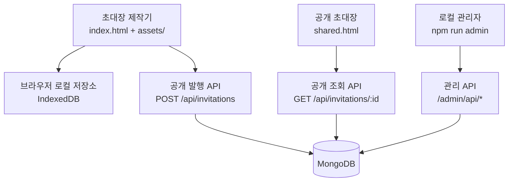

# 초대장 메이커 아키텍처

이 문서는 현재 서비스 구조를 설명하고, 유지보수를 위해 어떤 경계를 먼저 정리할지 기록한다. 현재 구현을 한 번에 프레임워크나 번들러로 옮기지 않고, 정적 제작기·공개 발행 API·로컬 관리자라는 실행 경계를 유지하면서 단계적으로 내부 모듈을 정리하는 것을 기준으로 한다.

## 현재 실행 경계

현재 코드의 주요 실행 흐름을 [Archify 구조도](archify/system.html)로 추가했다. [원본 JSON, 설치·재생성 방법 및 검증 근거](archify/README.md)를 함께 보관한다. 이는 코드 구조를 검토해 작성한 모델을 Archify로 렌더링한 결과다. 기존 Graphify 분석은 리팩토링 이전 `server/` 구조만 대상으로 한 별도 자료다 — 이후 `server/http.cjs`가 `server/http/static.cjs`, `server/publishing/use-case.cjs`, `server/config/*`로 일부 쪼개졌으므로 노드/허브 수치는 그 이전 스냅샷 기준으로 읽어야 한다.

아래 "적극 검토한 리팩토링 방향"에서 제안했던 5단계는 모두 코드에 반영되었다. 1~5단계 전부 완료 상태이며, 공개/관리자 저장소와 설정도 각자 모듈로 완전히 분리되었다. 자세한 진척은 "실행 순서와 진척 현황" 절을 참고한다.



원본 다이어그램은 [`diagrams/invitation-maker-architecture.mmd`](diagrams/invitation-maker-architecture.mmd)와 [`diagrams/public-publishing-flow.mmd`](diagrams/public-publishing-flow.mmd)에 보관한다. Graphify가 생성한 서버 call-flow HTML은 [`graphify/callflow.html`](graphify/callflow.html)에서 브라우저로 열 수 있다.

## 현재 디렉토리 책임

| 영역 | 현재 위치 | 책임 | 경계 상태 |
| --- | --- | --- | --- |
| 제작기 UI | `index.html`, `assets/studio/` (`app.js`, `style.css`, `studio.css`, `content-order.js`, `preset-application.js`) | 편집 상태, 미리보기, 내보내기 | 브라우저 전용, 도메인별 디렉토리로 이동 완료 |
| 초대장 도메인 | `assets/invitation/` (`core.js`, `template-catalog.js`, `template-renderers.js`, `template-art.js`, `intro-effects.js`, `viewer.js`) | 정규화, 템플릿, HTML 렌더링 | 공유 규칙이 가장 많은 핵심. `assets/invitation-core.js`는 `./invitation/core.js`를 재노출하는 호환 shim으로만 남음 |
| 로컬 데이터 | `assets/storage/invitation-storage.js` | IndexedDB 초안/라이브러리 | 브라우저 저장소 어댑터 |
| 공개 발행 클라이언트 | `assets/publishing/` (`publishing.js`, `shared-invitation.js`) | 토큰 보관, 재시도, 발행/삭제 | 공개 API와 강하게 연결 |
| 분석/연동/미디어 | `assets/analytics/` (`analytics.js`, `ga4.js`, `config.js`), `assets/integrations/map-location.js`, `assets/media/` (`hero-image.js`, `image-tools.js`, `social-preview-v1.png`) | GA4 연동, 지도, 이미지 처리 | 도메인별 디렉토리로 이동 완료 |
| 공개 API (HTTP 어댑터) | `api/`, `server/http.cjs`, `server/http/static.cjs` | Vercel 어댑터, HTTP 계약, 정적 파일 응답 | `static.cjs` 분리 완료 (`server/http.cjs`가 require) |
| 발행 유스케이스 | `server/publishing/use-case.cjs`, `server/validation.cjs` | 발행 유스케이스, 오류 매핑, 입력 검증 | 추출 완료 (`server/http.cjs`가 `publishInvitation`/`mapRepositoryError`를 require) |
| 저장소 (공개) | `server/storage/mongo-publications.cjs` | Mongo 연결, quota, 읽기 쿼리에서의 만료 강제, `publish/get/refreshExpiry/remove/close/dropDatabase` | 계약 분리 완료. `server/index.cjs`, `api/invitations.js`, `scripts/verify-publishing-mongo.cjs`, `tests/publishing-server.test.js` 네 곳 모두 이 모듈을 require |
| 저장소 (관리자) | `admin/storage/mongo-publications.cjs` | 목록/조회/폐기, injectable `collectionFactory` | 계약 분리 완료. `admin/index.cjs`가 이 모듈만 사용 |
| 설정 | `server/config/database.cjs`, `server/config/http.cjs`, `server/config/publishing.cjs`, `admin/config.cjs` | 환경변수 읽기, HTTP/발행/DB 설정값 | 이동 완료. `server/index.cjs`·`api/invitations.js`는 세 리더를 조합해서 쓰고, `admin/index.cjs`는 `readDatabaseConfigFromEnv`만 사용. `server/validation.cjs`는 `DEFAULT_PUBLISHING_CONFIG`를 `config/publishing.cjs`에서 가져옴 |
| 관리자 | `admin/` | 로그인, 세션, 목록, 페이지, 폐기 | 공개 배포와 분리된 로컬 서비스 |
| 운영 문서 | `docs/` | 기능, 설계, 운영 절차 | 이 문서를 기준으로 확장 |

## Graphify 분석 결과

서버 코드에 대해 Graphify를 실행한 결과는 다음과 같다. 이 수치는 `server/http/static.cjs`, `server/publishing/use-case.cjs`, `server/config/*` 분리 이전의 `server/` 구조를 대상으로 측정한 것이므로, 현재 코드의 모듈 경계와는 다르다.

- 73개 노드, 160개 연결, 9개 커뮤니티
- import cycle 없음
- 핵심 허브: `handlePost()`, `normalizeForPublishing()`, `validateKnownInvitationFields()`, `createHandler()`, `createMongoRepository()`
- 가장 큰 연결 집중 지점은 `server/http.cjs`의 요청 처리와 `server/validation.cjs`의 정규화 함수다.
- `createMongoRepository()`가 설정과 저장소 커뮤니티를 연결하고, `normalizeForPublishing()`이 입력 검증·템플릿 정규화·발행 흐름을 가로지른다.

전체 원본은 [`graphify/GRAPH_REPORT.md`](graphify/GRAPH_REPORT.md), [`graphify/graph.json`](graphify/graph.json)에 보관한다.

Graphify의 SVG export는 현재 환경에서 `matplotlib`이 없어 생성하지 못했다. 대신 Mermaid 기반 원본과 인터랙티브 call-flow HTML을 보관했다.

## 적극 검토한 리팩토링 방향

이 섹션은 리팩토링을 검토하던 시점에 작성한 분석과 제안을 그대로 보존한다. 각 항목의 "현재"는 검토 당시(리팩토링 이전)의 코드 상태를 가리키며, 이후 실제로 무엇이 어떻게 반영되었는지는 각 항목의 "실제 구현 경로" 콜아웃과 아래 "실행 순서와 진척 현황" 절에 기록한다.

### 1. 설정값을 도메인별로 분리

검토 당시에는 공개 서버 설정은 `server/config.cjs`, 관리자 설정은 `admin/config.cjs`에 나뉘어 있었다. 이 경계는 맞지만 환경변수 이름과 기본값의 책임이 각 진입점에 흩어지기 쉬웠다.

다음 단계에서 설정을 아래처럼 명시적으로 나눈다.

```text
config/
  public.cjs       # MONGODB_*, PUBLISH_*, HOST, PORT
  admin.cjs        # ADMIN_*, PUBLIC_BASE_URL
  index.cjs        # 공통 env 읽기와 검증 결과 조립
```

단, `config/index.cjs`가 모든 설정을 하나의 거대한 객체로 합치지는 않는다. 공개 서버와 관리자 서버가 각자 필요한 설정만 받도록 유지해야 환경변수 누출과 테스트 결합을 줄일 수 있다.

> **실제 구현 경로**: 위 `config/public.cjs`·`config/admin.cjs`·`config/index.cjs` 구조는 검토 당시의 제안이다. 실제로는 `server/config/database.cjs`, `server/config/http.cjs`, `server/config/publishing.cjs` 세 모듈로 나뉘었고, 제안했던 `config/index.cjs` 통합 객체는 의도적으로 만들지 않았다 — 각 진입점이 필요한 설정 도메인만 require한다. 구 `server/config.cjs`는 삭제되었다. 자세한 반영 상태는 "실행 순서와 진척 현황"의 4단계를 참고한다.

### 2. 발행 도메인과 HTTP 어댑터 분리

현재 `server/http.cjs`가 다음 일을 함께 담당한다.

- 요청 본문 읽기
- origin/token/idempotency 검증
- 초대장 정규화
- 만료 계산 (`server/publishing/expiry.cjs` 위임)
- repository 호출
- HTTP 오류 매핑
- 정적 파일 응답

다음 구조가 유지보수에 유리하다.

```text
server/
  domain/publishing/
    publish-service.cjs       # 발행 유스케이스
    publication-errors.cjs    # 도메인 오류
  adapters/http/
    public-handler.cjs        # 공개 API HTTP 변환
    static-handler.cjs        # 정적 파일
  adapters/mongo/
    publication-repository.cjs
  validation.cjs
```

`publish-service.cjs`는 Node `req/res`를 몰라야 한다. 그러면 Vercel 어댑터, standalone Node 서버, 향후 로그인 사용자 발행 API가 같은 발행 유스케이스를 재사용할 수 있다.

> **실제 구현 경로**: 위 `domain/publishing/adapters/...` 구조는 검토 당시의 제안이다. 실제로는 더 단순하게 `server/publishing/use-case.cjs`(`publishInvitation`, `mapRepositoryError`)로 추출되었고 `server/http.cjs`가 이를 require한다. 별도의 `adapters/` 계층은 만들지 않았다. 자세한 반영 상태는 "실행 순서와 진척 현황"의 2단계를 참고한다.

### 3. 저장소 인터페이스 명시

검토 당시에는 `mongo-repository.cjs`가 공개 발행과 관리자 목록/상세/폐기를 모두 제공했다. 공유 자체는 합리적이지만 Mongo 쿼리 결과가 HTTP 계층으로 직접 새어나갈 위험이 있었다.

다음 인터페이스를 먼저 고정한다.

```text
PublicationStore
  publish(input)
  getPublic(id)
  removeByOwnerToken(id, tokenHash)
  listForAdmin(criteria)
  getForAdmin(id)
  revokeByAdmin(id)
```

Mongo 구현은 이 인터페이스를 구현하고, 관리자/공개 응답용 DTO를 저장 문서와 분리한다. 이렇게 하면 PostgreSQL 전환이나 테스트용 메모리 저장소를 추가해도 HTTP 코드를 수정하지 않아도 된다.

> **실제 구현 경로**: 위 `PublicationStore` 인터페이스는 검토 당시의 제안이며, 메서드 이름(`publish`/`getPublic`/`removeByOwnerToken`/`listForAdmin`/`getForAdmin`/`revokeByAdmin`) 그대로 구현되지는 않았다. 실제로는 공개용 `server/storage/mongo-publications.cjs`(`createMongoPublicationsRepository` — `publish`/`get`/`remove`/`close`/`dropDatabase`)와 관리자용 `admin/storage/mongo-publications.cjs`(`createAdminMongoPublications` — `list`/`getAdmin`/`revoke`/`close`)로 분리되었고, 구 `server/mongo-repository.cjs`는 삭제되었다. 자세한 반영 상태는 "실행 순서와 진척 현황"의 3단계를 참고한다.

### 4. 브라우저 자산을 도메인별로 묶기

검토 당시에는 `assets/`가 제작기, 초대장 렌더링, 발행, 분석, 지도, 저장소가 한 단계에 섞여 있었다. 번들러 도입 없이도 다음과 같이 이동할 수 있다는 것이 당시의 제안이었다.

```text
assets/
  studio/       # app, studio.css, preset-application
  invitation/   # invitation-core, template-*, intro-effects
  publishing/   # publishing, shared-invitation
  storage/      # invitation-storage
  analytics/    # analytics, analytics-ga4, analytics-config
  integrations/ # map-location, image-tools
```

이 작업은 HTML의 `<script>` 순서와 상대경로를 모두 바꾸므로 1차 서버 리팩토링과 분리한다. 먼저 각 도메인의 공개 전역과 의존 순서를 문서화하고, 파일 이동은 한 도메인씩 진행한다.

> **실제 구현 경로**: 위 배치는 대체로 그대로 반영되었다 — `assets/studio/`, `assets/invitation/`, `assets/publishing/`, `assets/storage/`, `assets/analytics/`로 이동했다. 다만 `integrations/`에는 `map-location.js`만 남았고, `image-tools.js`·`hero-image.js`·`social-preview-v1.png`는 계획에 없던 `assets/media/`로 묶였다. 또한 `assets/invitation-core.js`는 삭제되지 않고 `./invitation/core.js`를 재노출하는 호환 shim으로 남아 있다 (남은 작업 절 참고). 자세한 반영 상태는 "실행 순서와 진척 현황"의 5단계를 참고한다.

### 5. 관리자 서비스의 독립성 유지

관리자는 이미 `admin/`으로 분리되어 있으므로 공개 `server/http.cjs`에 다시 합치지 않는다. 향후 로그인 회원 기능이 추가되어도 다음 구분을 유지한다.

```text
admin/          # 운영자 세션과 발행 관리
server/domain/  # 발행 유스케이스와 저장소 계약
auth/           # 이후 회원 인증
```

> **실제 구현 경로**: `admin/`의 독립성은 유지되고 있다 (관리자는 `admin/index.cjs`, `admin/storage/mongo-publications.cjs`, `admin/config.cjs`만 사용). 다만 위 코드 블록의 `server/domain/`은 검토 당시의 계획 경로이며 실제로 만들어지지 않았다 — 발행 유스케이스는 `server/domain/`이 아니라 `server/publishing/use-case.cjs`에 있다 (항목 2 참고). `auth/`는 아직 존재하지 않는 향후 계획으로 남아 있다.

관리자 UI는 저장소 문서를 직접 표현하지 않고 관리자 DTO만 사용해야 한다. 현재도 token hash를 반환하지 않는 계약을 유지하고 있다.

## 실행 순서와 진척 현황

아래 5단계는 더 이상 미래 제안이 아니라 실제 반영 여부를 기록한 진척 현황이다. 각 단계마다 `npm test`, `npm run build:public`, 관리자 HTTP 테스트를 실행해 회귀를 확인했다 (현재 `npm test` 305개 중 304 pass / 0 fail / 1 skip, `npm run build:public` 성공, `git diff --check` 이상 없음).

1. **✅ 완료** — `server/http.cjs`에서 정적 파일 응답을 분리한다. → `server/http/static.cjs`로 추출되었고 `server/http.cjs:4`가 require한다.
2. **✅ 완료** — 발행 유스케이스를 추출하고 기존 공개 테스트를 그대로 통과시킨다. → 계획했던 `server/domain/publishing/` 대신 `server/publishing/use-case.cjs`로 추출되었다 (`mapRepositoryError`, `publishInvitation`). `server/http.cjs:5`가 require한다.
3. **✅ 완료** — `PublicationStore` 계약과 Mongo 어댑터를 분리한다. → 공개 쪽: `server/storage/mongo-publications.cjs`(`createMongoPublicationsRepository`, `publish/get/remove/close/dropDatabase`)가 공개 발행 경로 네 곳 모두에 연결되었다 (`server/index.cjs`, `api/invitations.js`, `scripts/verify-publishing-mongo.cjs`, `tests/publishing-server.test.js`). 관리자 쪽: `admin/storage/mongo-publications.cjs`(`createAdminMongoPublications`, `list/getAdmin/revoke/close`)가 여전히 관리자 전용으로 남아 있다. **구 `server/mongo-repository.cjs`는 삭제되었고 남은 참조는 없다** — 공개/관리자 저장소가 각자 모듈로 완전히 분리되었다.
4. **✅ 완료** — 공개/관리자 설정을 `config/`로 이동한다. → `server/config/database.cjs`(`readDatabaseConfigFromEnv`), `server/config/http.cjs`(`readHttpConfigFromEnv`), `server/config/publishing.cjs`(`readPublishingConfigFromEnv`, `DEFAULT_PUBLISHING_CONFIG`, `PUBLISHING_ERROR_MESSAGES`)가 모두 연결되었다. `server/index.cjs`와 `api/invitations.js`는 세 리더를 호출 지점에서 조합한다. `admin/index.cjs`는 이제 `readDatabaseConfigFromEnv` **하나만** require하며, 공개 서버의 HTTP/발행 설정은 더 이상 가져오지 않는다. `server/validation.cjs`는 `DEFAULT_PUBLISHING_CONFIG`를 `./config/publishing.cjs`에서 가져온다. **구 `server/config.cjs`는 삭제되었고 남은 참조는 없다.** 설정 키 구성은 구 `readConfigFromEnv`와 필드 단위로 동일함을 확인했다 (누락/추가 0). 계획 당시 경고했던 대로 병합형 `config/index.cjs`는 만들지 않았다 — `server/config/`에는 `database.cjs`, `http.cjs`, `publishing.cjs` 세 파일만 있고, 각 진입점은 필요한 설정 도메인만 require한다. 관리자 설정은 원래 계획대로 `admin/config.cjs`에 남아 있다.
5. **✅ 완료** — 브라우저 `assets/`를 도메인별 하위 디렉토리로 이동한다. → `assets/studio/`, `assets/invitation/`, `assets/publishing/`, `assets/storage/`, `assets/analytics/`, `assets/integrations/`, `assets/media/`로 이동되었다. `index.html`, `shared.html`, `viewer.html`과 테스트 참조 모두 새 경로로 갱신되었고, `assets/invitation-core.js`는 `./invitation/core.js`를 재노출하는 호환 shim으로만 남아 있다.

## 남은 작업

위 5단계는 모두 완료되었고 구 `server/mongo-repository.cjs`, 구 `server/config.cjs`는 삭제되었다. 실제로 남은 정리 항목은 다음 하나다.

- **`assets/invitation-core.js` shim 제거**: 이 파일은 `./invitation/core.js`를 재노출하는 호환 shim으로만 남아 있다. `server/validation.cjs:3`과 `tests/publishing-server.test.js:11`이 아직 이 shim 경로로 require한다. 두 곳을 `../assets/invitation/core.js`(또는 상대 경로에 맞는 직접 경로)로 바꾸면 shim을 제거할 수 있다.

## 리팩토링하지 않을 것

- 현재 기능 범위에서 Node 프레임워크를 새로 도입하지 않는다.
- MongoDB를 즉시 PostgreSQL로 바꾸지 않는다. 현재 발행 모델은 문서 스냅샷과 Base64 이미지에 맞춰져 있다.
- 공유 링크, 로그인, RSVP를 이번 구조 정리와 한 번에 묶지 않는다.
- 공개 API와 관리자 API를 하나의 인증 흐름으로 합치지 않는다.
