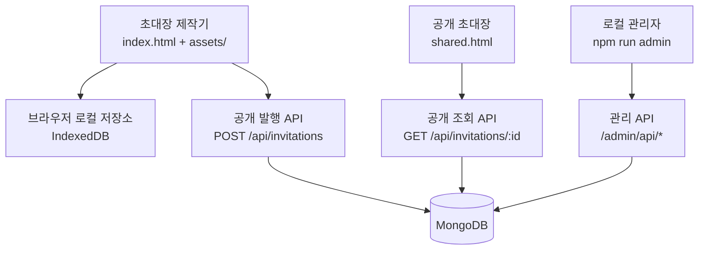

# 초대장 메이커 아키텍처

이 문서는 현재 서비스 구조를 설명하고, 유지보수를 위해 어떤 경계를 먼저 정리할지 기록한다. 현재 구현을 한 번에 프레임워크나 번들러로 옮기지 않고, 정적 제작기·공개 발행 API·로컬 관리자라는 실행 경계를 유지하면서 단계적으로 내부 모듈을 정리하는 것을 기준으로 한다.

## 현재 실행 경계



원본 다이어그램은 [`diagrams/invitation-maker-architecture.mmd`](diagrams/invitation-maker-architecture.mmd)와 [`diagrams/public-publishing-flow.mmd`](diagrams/public-publishing-flow.mmd)에 보관한다. Graphify가 생성한 서버 call-flow HTML은 [`graphify/callflow.html`](graphify/callflow.html)에서 브라우저로 열 수 있다.

## 현재 디렉토리 책임

| 영역 | 현재 위치 | 책임 | 경계 상태 |
| --- | --- | --- | --- |
| 제작기 UI | `index.html`, `assets/app.js`, `assets/studio.css` | 편집 상태, 미리보기, 내보내기 | 브라우저 전용 |
| 초대장 도메인 | `assets/invitation-core.js`, `template-*.js` | 정규화, 템플릿, HTML 렌더링 | 공유 규칙이 가장 많은 핵심 |
| 로컬 데이터 | `assets/invitation-storage.js` | IndexedDB 초안/라이브러리 | 브라우저 저장소 어댑터 |
| 공개 발행 클라이언트 | `assets/publishing.js` | 토큰 보관, 재시도, 발행/삭제 | 공개 API와 강하게 연결 |
| 공개 API | `api/`, `server/http.cjs` | Vercel 어댑터, HTTP 계약 | 공개 배포 경계 |
| 발행 도메인 | `server/validation.cjs` | 입력 검증, ID, TTL 계산에 필요한 값 | HTTP 핸들러에서 직접 호출 |
| 저장소 | `server/mongo-repository.cjs` | Mongo 연결, quota, TTL, CRUD | 공개 API와 관리자 API가 공유 |
| 관리자 | `admin/` | 로그인, 세션, 목록, 페이지, 폐기 | 공개 배포와 분리된 로컬 서비스 |
| 운영 문서 | `docs/` | 기능, 설계, 운영 절차 | 이 문서를 기준으로 확장 |

## Graphify 분석 결과

서버 코드에 대해 Graphify를 실행한 결과는 다음과 같다.

- 73개 노드, 160개 연결, 9개 커뮤니티
- import cycle 없음
- 핵심 허브: `handlePost()`, `normalizeForPublishing()`, `validateKnownInvitationFields()`, `createHandler()`, `createMongoRepository()`
- 가장 큰 연결 집중 지점은 `server/http.cjs`의 요청 처리와 `server/validation.cjs`의 정규화 함수다.
- `createMongoRepository()`가 설정과 저장소 커뮤니티를 연결하고, `normalizeForPublishing()`이 입력 검증·템플릿 정규화·발행 흐름을 가로지른다.

전체 원본은 [`graphify/GRAPH_REPORT.md`](graphify/GRAPH_REPORT.md), [`graphify/graph.json`](graphify/graph.json)에 보관한다.

Graphify의 SVG export는 현재 환경에서 `matplotlib`이 없어 생성하지 못했다. 대신 Mermaid 기반 원본과 인터랙티브 call-flow HTML을 보관했다.

## 적극 검토한 리팩토링 방향

### 1. 설정값을 도메인별로 분리

현재 공개 서버 설정은 `server/config.cjs`, 관리자 설정은 `admin/config.cjs`에 나뉘어 있다. 이 경계는 맞지만 환경변수 이름과 기본값의 책임이 각 진입점에 흩어지기 쉽다.

다음 단계에서 설정을 아래처럼 명시적으로 나눈다.

```text
config/
  public.cjs       # MONGODB_*, PUBLISH_*, HOST, PORT
  admin.cjs        # ADMIN_*, PUBLIC_BASE_URL
  index.cjs        # 공통 env 읽기와 검증 결과 조립
```

단, `config/index.cjs`가 모든 설정을 하나의 거대한 객체로 합치지는 않는다. 공개 서버와 관리자 서버가 각자 필요한 설정만 받도록 유지해야 환경변수 누출과 테스트 결합을 줄일 수 있다.

### 2. 발행 도메인과 HTTP 어댑터 분리

현재 `server/http.cjs`가 다음 일을 함께 담당한다.

- 요청 본문 읽기
- origin/token/idempotency 검증
- 초대장 정규화
- TTL 계산
- repository 호출
- HTTP 오류 매핑
- 정적 파일 응답

다음 구조가 유지보수에 유리하다.

```text
server/
  domain/publishing/
    publish-service.cjs       # 발행 유스케이스
    publication-errors.cjs    # 도메인 오류
  adapters/http/
    public-handler.cjs        # 공개 API HTTP 변환
    static-handler.cjs        # 정적 파일
  adapters/mongo/
    publication-repository.cjs
  validation.cjs
```

`publish-service.cjs`는 Node `req/res`를 몰라야 한다. 그러면 Vercel 어댑터, standalone Node 서버, 향후 로그인 사용자 발행 API가 같은 발행 유스케이스를 재사용할 수 있다.

### 3. 저장소 인터페이스 명시

현재 `mongo-repository.cjs`가 공개 발행과 관리자 목록/상세/폐기를 모두 제공한다. 공유 자체는 합리적이지만 Mongo 쿼리 결과가 HTTP 계층으로 직접 새어나갈 위험이 있다.

다음 인터페이스를 먼저 고정한다.

```text
PublicationStore
  publish(input)
  getPublic(id)
  removeByOwnerToken(id, tokenHash)
  listForAdmin(criteria)
  getForAdmin(id)
  revokeByAdmin(id)
```

Mongo 구현은 이 인터페이스를 구현하고, 관리자/공개 응답용 DTO를 저장 문서와 분리한다. 이렇게 하면 PostgreSQL 전환이나 테스트용 메모리 저장소를 추가해도 HTTP 코드를 수정하지 않아도 된다.

### 4. 브라우저 자산을 도메인별로 묶기

현재 `assets/`는 제작기, 초대장 렌더링, 발행, 분석, 지도, 저장소가 한 단계에 섞여 있다. 번들러 도입 없이도 다음과 같이 이동할 수 있다.

```text
assets/
  studio/       # app, studio.css, preset-application
  invitation/   # invitation-core, template-*, intro-effects
  publishing/   # publishing, shared-invitation
  storage/      # invitation-storage
  analytics/    # analytics, analytics-ga4, analytics-config
  integrations/ # map-location, image-tools
```

이 작업은 HTML의 `<script>` 순서와 상대경로를 모두 바꾸므로 1차 서버 리팩토링과 분리한다. 먼저 각 도메인의 공개 전역과 의존 순서를 문서화하고, 파일 이동은 한 도메인씩 진행한다.

### 5. 관리자 서비스의 독립성 유지

관리자는 이미 `admin/`으로 분리되어 있으므로 공개 `server/http.cjs`에 다시 합치지 않는다. 향후 로그인 회원 기능이 추가되어도 다음 구분을 유지한다.

```text
admin/          # 운영자 세션과 발행 관리
server/domain/  # 발행 유스케이스와 저장소 계약
auth/           # 이후 회원 인증
```

관리자 UI는 저장소 문서를 직접 표현하지 않고 관리자 DTO만 사용해야 한다. 현재도 token hash를 반환하지 않는 계약을 유지하고 있다.

## 권장 실행 순서

1. `server/http.cjs`에서 정적 파일 응답을 분리한다.
2. 발행 유스케이스를 `server/domain/publishing/`으로 추출하고 기존 공개 테스트를 그대로 통과시킨다.
3. `PublicationStore` 계약과 Mongo 어댑터를 분리한다.
4. 공개/관리자 설정을 `config/`로 이동한다.
5. 브라우저 `assets/`를 도메인별 하위 디렉토리로 이동한다.
6. 각 단계 후 `npm test`, `npm run build:public`, 관리자 HTTP 테스트를 실행한다.

## 리팩토링하지 않을 것

- 현재 기능 범위에서 Node 프레임워크를 새로 도입하지 않는다.
- MongoDB를 즉시 PostgreSQL로 바꾸지 않는다. 현재 발행 모델은 문서 스냅샷과 Base64 이미지에 맞춰져 있다.
- 공유 링크, 로그인, RSVP를 이번 구조 정리와 한 번에 묶지 않는다.
- 공개 API와 관리자 API를 하나의 인증 흐름으로 합치지 않는다.
