# Invitation Studio UI/UX 글로벌 감사 리포트

| 항목 | 내용 |
| --- | --- |
| 작성일 | 2026-09-18 |
| 기준 커밋 | `ce7b65d` (main) |
| 관점 | UI/UX 총괄 PM, 글로벌 범용 서비스 출시 전제 |
| 검토 범위 | 스튜디오(01 디자인 · 02 내용 편집 · 03 완성 · 보관함), 공개 뷰어 `shared.html`, 에러 페이지, 코드베이스 전반 |
| 검토 환경 | Chrome, 데스크톱 1440px, 모바일 390px, 한국어/영어 양쪽 |
| 증거 | `screenshots/` 폴더의 실제 화면 캡처, 파일 경로 인용 |

## 한 줄 요약

국내용 초대장 제작기로는 완성도가 높지만, 글로벌 범용 서비스로는 **"언어만 영어인 한국 서비스"** 상태다. 지도·행사 분류·날짜·글꼴·법적 고지처럼 문구 번역으로는 해결되지 않는 구조적 갭이 먼저이고, 그 다음 실제 화면에서 확인한 시각 버그와 UX 마찰이 있다.

## 우선순위 한눈에 보기

| 우선순위 | 항목 | 성격 |
| --- | --- | --- |
| **P0 출시 차단** | A-1 지도 네이버 전용 · A-6 하드코딩 한국어 · A-7 에러 페이지 한국어 고정 · A-5 공개 링크 크롬 한국어 고정 · A-8 개인정보·동의 부재 · B-1 html 배경 버그 | 구조 + 버그 |
| **P1 첫인상** | A-2 행사 분류 · A-3 샘플 콘텐츠 · A-4 날짜 입력 · A-9 글꼴·문자 체계 · B-2 편집기 팔레트 누수 · B-3 모바일 갤러리 미리보기 | 구조 + 디자인 |
| **P2 완성도** | B-4 미리보기 폭 · B-5 갤러리 CTA 중복 · B-6 항목 카드 · B-7 추가 버튼 · B-8 보관함 · B-9 공유 다이얼로그 · B-10 모바일 헤더 · B-11 온보딩 · B-12 다크 모드 | UX 디테일 |
| **로드맵** | RSVP, 하객 시간대 변환, WhatsApp·iMessage 공유 타깃 | 기능 |

---

## A. 글로벌 출시를 막는 구조적 갭

### A-1. 지도가 네이버 전용이다 · P0

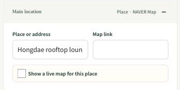

- **현상** 영어 UI에서도 장소 그룹 힌트가 "Place · NAVER Map"으로 노출된다. 지도 링크 입력은 네이버 호스트만 허용하고, 링크가 없을 때 초대장의 "Open in maps" 버튼은 `map.naver.com` 검색으로 연결된다.
- **근거** `assets/integrations/map-location.js` 19행의 허용 호스트 목록, `assets/invitation/core.js`의 `getMapFallbackUrl`.
- **영향** 한국 밖 사용자는 지도 기능을 전혀 쓸 수 없고, 하객은 열리지 않는 지도 서비스로 보내진다.
- **권장** Google Maps · Apple Maps 범용 링크와 `geo:` URI 허용, 지도 링크 검증을 공급자 중립으로 전환, 동적 지도는 공급자 추상화 레이어 뒤로. 라벨에서 공급자 이름 제거.

### A-2. 행사 분류가 한국 생활사 기준이다 · P1

- **현상** 최상위 카테고리가 데이트 · 생일 · 기념일 · 행사 · 유치원 · 결혼 · 고희 · 환갑 · 돌잔치다. 영어에서는 "70th Birthday", "60th Birthday", "First Birthday", "Kindergarten"으로 번역되어 있으나 글로벌 사용자에게는 왜 이 넷이 최상위인지 설명되지 않는다.
- **근거** `invitation-data.json` occasions, `assets/invitation/template-catalog.js`의 `OCCASION_IDS`.
- **영향** Baby shower, Graduation, Housewarming, Retirement, Holiday party, Corporate event 같은 글로벌 표준 카테고리가 없다. 생일만 8종, 나머지는 2종씩이라 선택지가 빈약해 보인다.
- **권장** 글로벌 공통 카테고리를 1차로 두고, 지역 특화 카테고리(돌·환갑·고희)는 로케일에 따라 노출하거나 "Milestone birthday" 하위로 재편.

### A-3. 샘플 콘텐츠가 서울 지명이다 · P1

- **현상** 영어 모드 기본값이 Hongdae rooftop lounge, Cheongdam, Hannam, Seongsu, 전화번호 `010-0000-0000`, "From. Sora"다. 코스 라벨은 MEET / CAFE / WALK / DINNER로 고정된다.
- **근거** `assets/i18n/content-en.json`, `assets/invitation/core.js` 144~155행 기본 초대장.
- **영향** 첫 화면에서 "내 나라 서비스가 아니다"라는 신호를 준다. 전화번호 형식은 국제 형식이 아니다.
- **권장** 지역 중립 샘플(예: "Rooftop lounge", "Riverside park"), 국제 전화번호 형식(+1 555 …), 로케일별 샘플 오버레이 확장.

### A-4. 날짜가 자유 텍스트 한 칸이다 · P1

- **현상** "Date and time"이 `type="text"` 입력이다. 날짜 선택기, 시간대, 캘린더 추가(.ics)가 없다. 영어는 무조건 미국식 `Sat, Dec 19, 2026 · 5:00 PM`이다.
- **근거** `index.html`의 `dateLabel` 입력, `assets/i18n/i18n.js`의 `LOCALES`가 `en-US` 하나뿐.
- **영향** 영국·유럽·호주 사용자는 `19 Dec 2026, 17:00`을 기대한다. 원격 하객이 많은 글로벌 초대에서는 시간대가 없으면 시간을 오해한다.
- **권장** 날짜·시간 선택기 + 자유 텍스트 폴백, 로케일 변형(en-GB, en-AU) 추가, 초대장에 "Add to calendar" 버튼과 시간대 표기.

### A-5. 공개 링크의 초대장 크롬이 항상 한국어로 렌더된다 · P0

- **현상** 발행 페이로드에 작성 언어가 없어 공개 뷰어는 초대장 내부 라벨("안내", "주소 보기")을 항상 한국어로 그린다. 문서에 의도된 설계로 적혀 있다.
- **근거** `docs/i18n.md` "Published (shared-link) invitations" 절, `assets/publishing/shared-invitation.js` 상단 주석.
- **영향** 영어 사용자가 발행한 링크에서 하객이 한국어 버튼을 본다. 글로벌 서비스에서는 치명적이다.
- **권장** 발행 스냅샷에 `language` 필드 추가, 서버 검증과 기존 레코드 기본값(`ko`) 마이그레이션.

### A-6. 사전 밖에 남은 한국어 하드코딩 · P0

- **현상** 사진 업로드 실패, IndexedDB 오류, 지도 링크 오류, 인트로 효과 라벨, 초대장 기본값("우리의 특별한 하루", "장소를 입력하세요")이 영어 UI에서도 한국어로 뜬다.
- **근거** `assets/media/image-tools.js` 13~20행, `assets/storage/invitation-storage.js` 18~85행, `assets/integrations/map-location.js`, `assets/invitation/intro-effects.js` 34~41행, `assets/invitation/core.js` 144~155행.
- **권장** 오류 코드만 던지고 문구는 사전에서 조회하도록 통일. `tests/i18n.test.js`에 하드코딩 한글 검출 테스트 추가.

### A-7. 에러 페이지가 한국어 고정이다 · P0

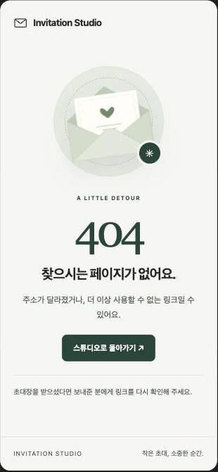

- **현상** 400~504 정적 에러 페이지 11개가 모두 `<html lang="ko">`이고 `data-i18n` 훅이 없다.
- **근거** `404.html` 등, `docs/error-pages.md`.
- **영향** 잘못된 링크로 들어온 해외 하객이 한국어만 본다. `shared.html`의 not-found 상태는 번역되므로 두 경로의 경험이 다르다.
- **권장** 에러 페이지에 i18n 엔진 로드, 또는 빌드 스크립트에서 언어별 정적 페이지 생성.

### A-8. 개인정보·동의 요소가 없다 · P0

- **현상** 개인정보처리방침, 이용약관, 쿠키·분석 동의 배너, 서버에 저장된 공개 링크의 보관 기간·삭제 요청 안내가 어디에도 없다. GA4·PostHog는 DNT/GPC만 존중하고 동의 없이 로드된다.
- **근거** `index.html` 푸터, `assets/analytics/analytics.js` 237행, `docs/analytics.md`.
- **영향** EU(GDPR/ePrivacy)와 캘리포니아(CCPA)에서 그대로 출시할 수 없다. 하객이 자기 이름·전화번호가 담긴 링크의 삭제를 요청할 경로가 없다.
- **권장** 푸터에 Privacy · Terms 링크, 지역 감지 기반 동의 배너, 공유 다이얼로그에 보관 기간과 삭제 경로 명시.

### A-9. 글꼴과 문자 체계가 한글+라틴만 가정한다 · P1

- **현상** 편집기에 "Korean font" 셀렉터가 모든 사용자에게 보인다. 일본어·중국어·태국어·아랍어·데바나가리는 폴백 폰트로 처리된다. `dir="rtl"` 처리가 없다. Google Fonts 11개 패밀리를 모든 페이지에서 로드한다.
- **근거** `index.html` 폰트 링크, `assets/invitation/core.js` 185행 `googleFontsUrl`.
- **영향** 비라틴·비한글 사용자는 밋밋하거나 깨진 타이포를 얻는다. Google Fonts가 차단된 지역에서는 초대장 타이포가 통째로 무너진다.
- **권장** "Korean font"를 "Script font"로 일반화하고 로케일별 기본값 제공, 시스템 폰트 스택 폴백 강화, 폰트 서브셋 지연 로드, RTL 언어 추가 시 `dir` 전환.

---

## B. 실제 화면에서 확인한 시각 버그와 UX 마찰

### B-1. 페이지 배경이 템플릿 분홍색으로 새어 나온다 · P0 버그

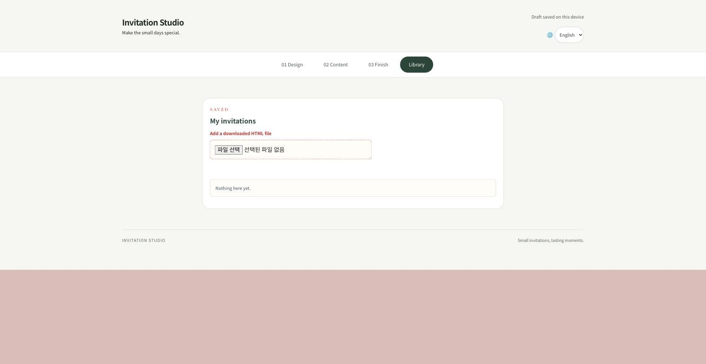

- **현상** `html` 요소 배경이 초대장 팔레트 `rgb(223,196,192)`라서 보관함 페이지 하단 절반, 그리고 모든 단계의 오버스크롤 영역이 분홍색으로 보인다.
- **근거** `assets/studio/style.css`의 `:root` 팔레트가 `html`까지 적용되고, `assets/studio/studio.css`는 `body`만 `#f7f7f4 !important`로 덮는다.
- **권장** `html { background: #f7f7f4 }`를 스튜디오 CSS에 추가. 한 줄 수정.

### B-2. 편집기 크롬이 초대장 팔레트를 물려받는다 · P1

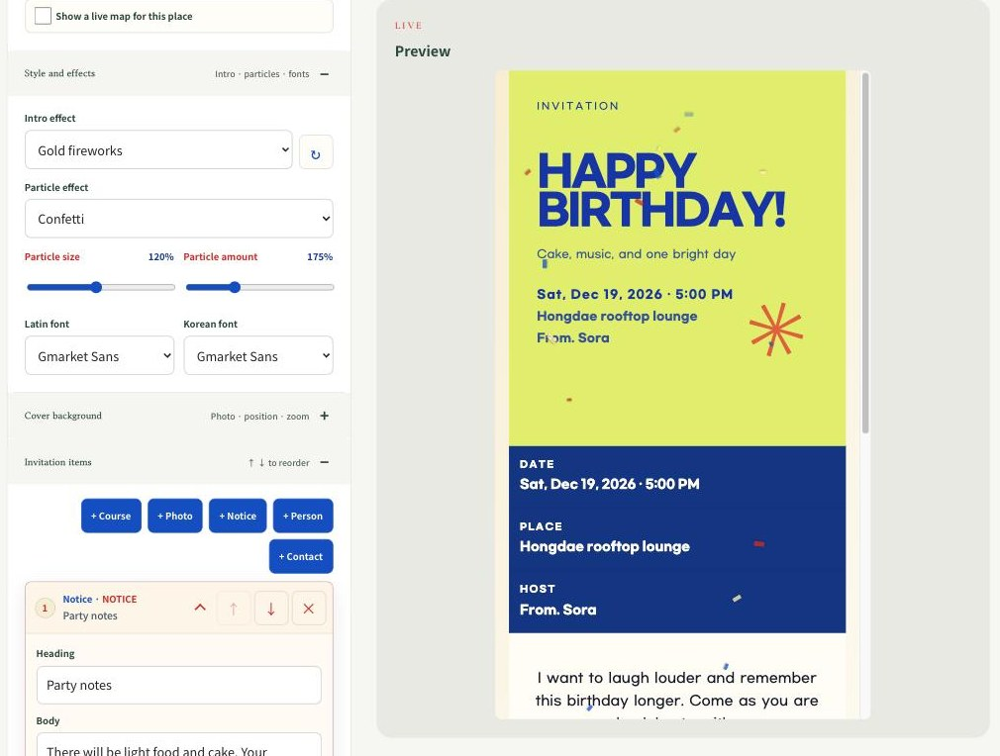

- **현상** "Let's Celebrate Loudly" 적용 시 "+ Course / + Photo" 버튼이 파란색, "LIVE" 아이브로우와 "Particle size", "Template background", 항목 카드 메타("NOTICE", "OPEN", 전화번호)가 빨간색이 된다. 보관함의 "SAVED", "Add a downloaded HTML file"도 빨간색이다.
- **근거** `DESIGN.md`는 "제작 컨트롤은 중립/그린, 초대장 팔레트와 독립"이라고 명시했으나 `studio.css`의 오버라이드가 `.add-item-button`, `.range-heading`, `.eyebrow`, `.content-item` 메타까지 닿지 않는다.
- **영향** 디자인을 바꿀 때마다 편집기 색이 따라 바뀌어 브랜드 일관성이 무너지고, 빨간 라벨은 오류 상태로 오독된다.
- **권장** 스튜디오 크롬 토큰(`--studio-ink`, `--studio-accent`)을 정의하고 편집기 안의 모든 컴포넌트가 이 토큰만 쓰도록 강제. 초대장 팔레트 변수는 미리보기 iframe 안에만 존재해야 한다.

### B-3. 모바일 갤러리에서 실물 크기 샘플을 볼 수 없다 · P1

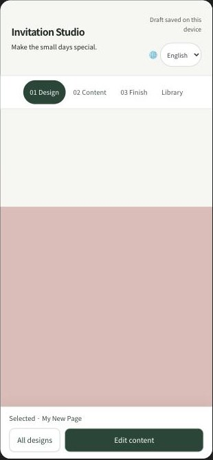

- **현상** 제작/미리보기 탭은 편집 단계에서만 보이고, 갤러리 단계의 미리보기 프레임은 CSS로 숨겨져 있다. 강제로 미리보기 뷰를 열면 빈 흰 영역과 분홍 배경만 남는다.
- **근거** `assets/studio/studio.css` 297~307행과 339행. 같은 파일 291~296행 주석은 "미리보기 탭 뒤에 실물 뷰가 있다"고 적혀 있어 코드와 어긋난다.
- **영향** 폰 사용자는 엄지손톱 썸네일만 보고 "이 디자인으로 만들기"를 눌러야 한다. 가장 중요한 결정 순간에 정보가 가장 적다.
- **권장** 카드 탭 시 바텀시트로 실물 크기 샘플을 띄우고, 시트 안에서 바로 적용할 수 있게 한다.

### B-4. 모바일 미리보기 폭이 실제 폰보다 좁아 결과를 오해하게 한다 · P2

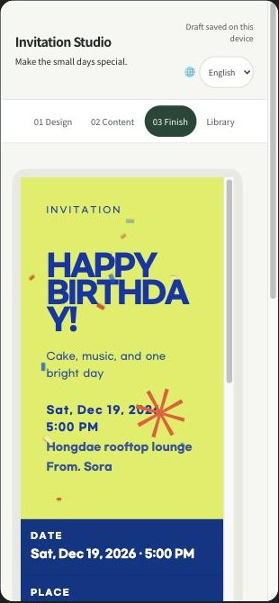

- **현상** 패널 패딩 때문에 프레임이 300px 남짓이라 "HAPPY BIRTHDAY!"가 "BIRTHDA / Y!"로 단어 중간에서 잘린다. 하객이 보는 390px 화면과 다르다.
- **근거** `.preview-panel { padding: 12px }`와 `.preview-frame { width: min(480px, 100%) }`, `template-renderers.js` 409행의 `overflow-wrap: anywhere`.
- **권장** 모바일에서는 프레임을 화면 가득 채우거나 디바이스 프레임 안에 축소 표시. 헤딩은 `overflow-wrap: anywhere`를 최후 폴백으로만 두고 `hyphens: auto`와 축소 폰트를 우선.

### B-5. 갤러리에 같은 행동의 CTA가 두 개다 · P2

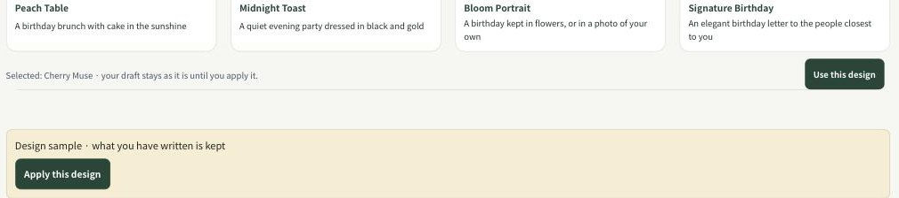

- **현상** 카드 아래 "Use this design"과 그 밑 노란 박스의 "Apply this design"이 동시에 보이고, 안내 문구도 두 번 반복된다.
- **근거** `index.html`의 `#apply-template-button`과 `#preview-apply-button`.
- **권장** 하나로 합치고, 적용 후에는 "Edit content"로 자연스럽게 바뀌는 흐름 유지.

### B-6. 항목 카드 헤더가 모바일에서 두 줄로 깨진다 · P2

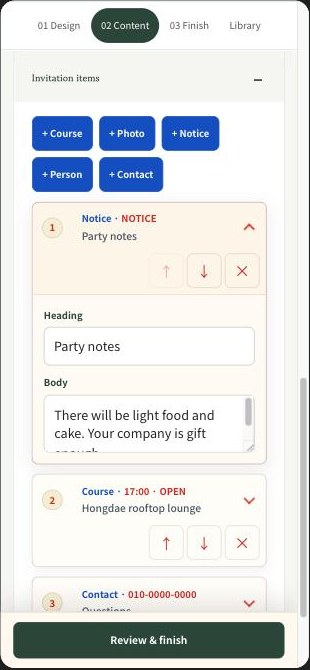

- **현상** ↑ ↓ ✕ 버튼이 다음 줄로 밀려 카드 헤더가 높아진다. 순서 변경이 화살표 방식이라 항목이 5개만 되어도 번거롭다. 삭제 확인은 브라우저 기본 `confirm()`이라 직접 만든 다이얼로그와 톤이 다르다.
- **근거** `assets/studio/app.js` 1577행 `window.confirm`, 항목 카드 렌더 마크업.
- **권장** 드래그 핸들 또는 길게 눌러 이동, 삭제는 카드 내 인라인 확인 또는 실행 취소 토스트. 헤더 컨트롤은 오버플로 메뉴(⋯)로 축소.

### B-7. "+ 항목 추가" 버튼 5개가 어색하게 줄바꿈된다 · P2

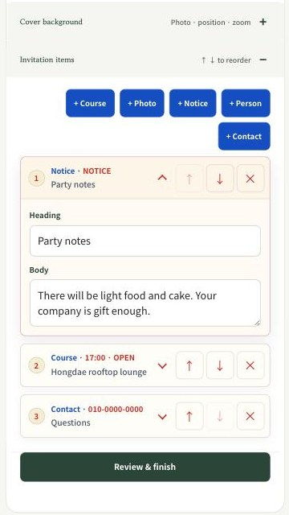

- **현상** 데스크톱은 4+1로 오른쪽 정렬된 고아 버튼이 생기고, 모바일도 3+2다.
- **권장** 아이콘+라벨 그리드(5열 균등) 또는 가로 스크롤 칩. 버튼은 스튜디오 토큰 색.

### B-8. 보관함이 막다른 길이다 · P2

- **현상** 빈 상태 문구 "Nothing here yet."만 있고 "새 초대장 만들기" CTA가 없다. 파일 업로드는 브라우저 기본 input 그대로라 영어 UI에서 브라우저 언어인 "파일 선택 / 선택된 파일 없음"이 노출된다(B-1 스크린샷 참고).
- **권장** 빈 상태에 일러스트 + "Start a new invitation" 버튼, 커스텀 드롭존.

### B-9. 공유 다이얼로그 정보 구조가 이중이다 · P2

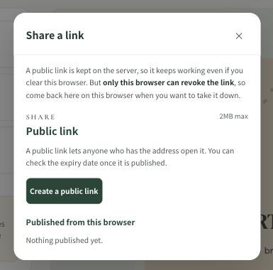

- **현상** 다이얼로그 제목 "Share a link" 아래 다시 "SHARE / Public link" 헤딩이 있다. "2MB max"는 사용자 언어가 아니다. 만료 기간은 "발행 후 확인할 수 있다"고 적혀 있어 결정 전에 알 수 없다. QR 코드, Web Share API, WhatsApp·iMessage 공유 타깃, 초대 메시지 템플릿이 없다.
- **근거** `index.html` `#share-dialog`, `assets/publishing/publishing.js` 패널 렌더.
- **권장** 헤딩 1단계로 정리, 만료 정책을 발행 전에 표시, 발행 후 QR·복사·시스템 공유 시트 3종 제공.

### B-10. 모바일 영어 헤더가 흔들린다 · P2

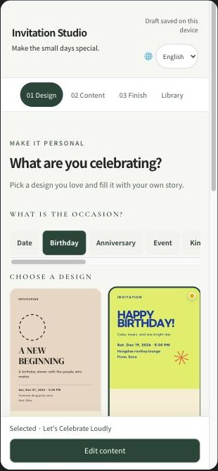

- **현상** "Draft saved on this device"가 두 줄로 접히고, 상태 문구와 언어 셀렉트가 11px다. 행사 칩은 가로 스크롤인데 잘림 힌트(그라데이션)가 없어 "Kin…" 뒤에 더 있다는 걸 알기 어렵다.
- **권장** 상태 문구는 아이콘+짧은 텍스트("Saved")로, 최소 12px. 칩 행에 페이드 마스크.

### B-11. 온보딩이 없다 · P2

- **현상** 첫 방문에 바로 갤러리로 떨어지고, 완성된 초대장이 어떤 경험인지 보여주는 "예시 보기"나 3단계 요약이 없다.
- **권장** 첫 화면 상단에 완성 초대장 예시 링크 1개와 "Pick → Fill → Share" 3단계 한 줄.

### B-12. 다크 모드 대응이 없다 · P2

- **현상** 스튜디오·공개 뷰어·에러 페이지 모두 `prefers-color-scheme` 처리가 없다.
- **근거** `grep prefers-color-scheme` 결과 0건.
- **권장** 최소한 공개 뷰어와 에러 페이지의 크롬은 다크 팔레트 제공. 초대장 본문은 디자인 고정이므로 제외 가능.

### 모바일 편집기 팔레트 누수 (B-2 보강)

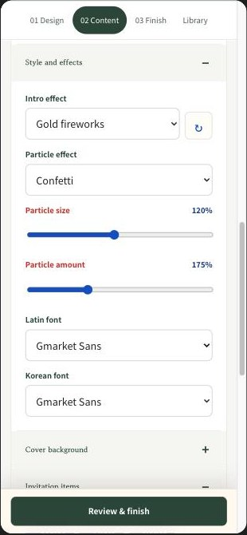

---

## C. 잘 되어 있는 것

- 미리보기가 실제 내보내기 문서와 동일한 `srcdoc` iframe이라 드리프트가 없다.
- 완성 단계의 세 가지 선택지와 "이 브라우저에만 저장" 경고는 정직하다.
- 포커스 링, 44px 터치 타깃, `aria-live` 상태, reduced-motion 처리가 일관된다.
- 공개 뷰어의 `noindex`와 `referrer: no-referrer`는 글로벌 기준으로도 좋은 프라이버시 기본값이다.
- 영어 카피 자체는 잘 쓰였다. 짧고 행동 중심이다.

---

## 부록: 검증 방법

1. `python3 -m http.server 4199`로 정적 서빙, Chrome에서 `?lang=en` / `?lang=ko`로 접속.
2. 데스크톱은 1440×900 창, 모바일은 390×844 iframe 하네스로 확인. 스크린샷은 `screenshots/`에 저장.
3. 코드 근거는 `grep`으로 하드코딩 한글, `prefers-color-scheme`, `beforeunload`, 네이버 호스트 목록을 확인.
4. 접근성은 페이지 랜드마크, 이미지 alt, iframe title, 터치 타깃 크기를 DOM에서 계산. 스크린리더 실기기 테스트는 하지 않았다.

## 다음 단계 제안

1. P0 다섯 건은 각각 독립 PR로 처리 가능하다. B-1은 한 줄, A-6·A-7은 사전 이관, A-5는 페이로드 필드 추가, A-8은 정책 문서 작성이 선행.
2. P1은 디자인 시스템 토큰 정의(B-2)를 먼저 잡아야 나머지 화면 작업이 흔들리지 않는다.
3. 글로벌 카테고리·샘플(A-2, A-3)은 마케팅·콘텐츠 결정이 필요하므로 별도 워크숍 권장.

---

## 해결 기록 (Resolution log)

이 감사가 지목한 항목은 모두 아래처럼 처리되었다. 위 본문과 스크린샷은 수정 전 상태를 그대로 남긴 기록이므로 고치지 않았다 — `screenshots/`의 캡처는 각 PR이 병합되기 전 시점의 화면이다.

| 항목 | 상태 | PR | 비고 |
| --- | --- | --- | --- |
| A-1 지도 네이버 전용 | 해결됨 (선행) | #26 | 이 계획이 시작되기 전 Google Maps 공급자(`mapProvider` 필드)로 이미 해결됨. |
| A-2 행사 분류 | 완료 | #42 | `group` 필드(`celebrate`/`milestone`/`family`/`gather`)로 재편, 갤러리 칩이 그룹별로 렌더링됨. |
| A-3 샘플 콘텐츠 | 완료 | #42 | 영어 샘플을 지역 중립으로 교체(Rooftop lounge, Riverside park 등), 전화번호 `+1 555 010 0000` 형식 적용. 한국어 샘플은 그대로 유지. |
| A-4 날짜 입력 | 완료 | #37 | `datetime-local` + 시간대 선택 + 로케일 포맷 + `.ics` 캘린더 링크. |
| A-5 공개 링크 크롬 언어 고정 | 완료 | #32 | 발행 페이로드에 `language` 필드 추가, 공유 뷰어가 저자 언어로 렌더링. |
| A-6 하드코딩 한국어 | 완료 | #30 | 오류·기본값 문구를 사전 키(`errors.*`, `invitation.default*`)로 이관. |
| A-7 에러 페이지 한국어 고정 | 완료 | #34 | 정적 에러 페이지에 두 언어 사본을 인라인하고 부팅 스크립트로 전환. |
| A-8 개인정보·동의 부재 | 완료 | #40 | `privacy.html`/`terms.html` 신설, 동의 배너와 분석 게이팅 추가. |
| A-9 글꼴·문자 체계 | 완료 | #31 | "Korean font"를 "Script font"로 일반화, 사용 중인 글꼴만 로드. |
| B-1 html 배경 버그 | 완료 | #29 | `html { background: var(--studio-paper) }`로 수정. |
| B-2 편집기 팔레트 누수 | 완료 | #29 | 스튜디오 크롬 토큰(`--studio-*`) 도입, 편집기 컴포넌트를 토큰에 고정. |
| B-3 모바일 갤러리 미리보기 | 완료 | #39 | 카드 탭 시 실물 크기 샘플을 바텀시트(`#sample-sheet`)로 표시. |
| B-4 미리보기 폭 | 완료 | #39 | 모바일 프레임이 실제 폰 폭으로 렌더링되도록 패딩 조정. |
| B-5 갤러리 CTA 중복 | 완료 | #38 | 적용 버튼을 하나로 통합. |
| B-6 항목 카드 | 완료 | #35 | 카드 헤더를 메뉴(⋯)로 축소, 삭제는 카드 내 인라인 확인. |
| B-7 추가 버튼 줄바꿈 | 완료 | #35 | 항목 편집기 명령 그리드/칩 레이아웃으로 재정리. |
| B-8 보관함 막다른 길 | 완료 | #38 | 빈 상태에 일러스트와 "Start a new invitation" 버튼 추가. |
| B-9 공유 다이얼로그 이중 구조 | 완료 | #36 | 헤딩 1단계로 정리, QR 코드·시스템 공유·만료 정책 선표시 추가. |
| B-10 모바일 헤더 흔들림 | 완료 | #38 | 상태 문구를 아이콘+짧은 텍스트로 축소, 행사 칩 행에 페이드 마스크. |
| B-11 온보딩 없음 | 해결됨 (선행) | #26 | 이 계획이 시작되기 전 상태 인지형 진입(`/` 랜딩, `/guide` 가이드, `/studio` 제작기)으로 이미 해결됨. |
| B-12 다크 모드 없음 | 완료 | #33 | 사이트 크롬에 `prefers-color-scheme` 다크 팔레트 추가. |
| 회귀: studio.css 중괄호 불균형 | 완료 | #41 | 병합 후 스모크 테스트로 발견된 회귀. `@media (max-width: 420px)` 블록이 닫히지 않아 바텀시트와 모바일 헤더 규칙이 무효화되던 문제를 수정하고, 재발 방지를 위해 중괄호 균형 테스트(`tests/studio-chrome.test.js`)를 추가함. |
| 문서 동기화 (설계·i18n·감사 문서) | 완료 | #43 | 글로벌 대응 작업 내용을 DESIGN.md·i18n.md와 감사 문서에 기록. |
| 운영자·연락처 명시 | 완료 | #44 | `privacy.html`/`terms.html`에 실제 운영자(오재성)와 연락처(rojae@kakao.com)를 채워, 그전까지 남아 있던 `[OPERATOR]`/`[CONTACT_EMAIL]` 자리표시자를 제거함. |
| 언어 전환 후 미터치 샘플 재적용 | 완료 | #45 | 디자인을 적용한 뒤에도, 아직 손대지 않은 샘플 콘텐츠라면 언어 전환을 계속 따라가도록 수정. |
| 제목 줄바꿈(모바일 폭) | 완료 | #46 | 히어로와 인트로 오버레이의 제목이 휴대폰 폭에서 단어 중간에 잘리지 않도록 수정. |
| 행사 만료 + 아트워크 지연 로딩 | 완료 | #47 | 초대장이 행사일 이후까지도(이벤트 하한) 열려 있도록 만료 규칙을 고치고, 템플릿 아트워크를 전량 인라인 대신 실제로 쓰는 것만 내려받도록 전환 (서비스 점검 보고서의 F2·U2 해결). |
| 데스크톱 편집기 폭 | 완료 | #48 | 미리보기 칸이 비워 두던 공간을 편집기에 배분 (서비스 점검 보고서의 U1 해결). |
| 보관함 카드 미리보기 · 발행 목록 | 완료 | #49 | 보관함 카드에 초대장 미리보기를, 발행된 링크를 카드 옆에 표시 (서비스 점검 보고서의 F4·F5 해결). |
| 카피·샘플 정리 | 완료 | #50 | 랜딩 alt 텍스트 번역, 화살표 힌트 제거, 공유 카피 다듬기, 자리표시자 샘플 삭제. |
| CI 게이팅 · 테스트 커버리지 | 완료 | #51 | 생성된 페이지와 템플릿 아트를 CI에서 검증하고, Mongo가 있는 잡에서 실제 Mongo 테스트를 실행하며 미검증 경로에 테스트를 추가. |
| 스튜디오 CSS 통합 | 완료 | #52 | 스튜디오 스타일시트를 하나로 통합하고 보관함 크롬을 스튜디오 토큰에 고정. |
| 초안 언어 기억 | 완료 | #53 | 초안이 작성된 언어를 기억해, 손대지 않은 샘플이 부팅 시점부터 스튜디오 언어를 따르게 함. |
| 한국어 카피 교정 | 완료 | #54 | 조사·존댓말·용어를 다듬고 죽은 사전 키를 정리, 구조화 데이터(JSON-LD)의 언어를 동기화. |
| 접근성(고정 제목·스킵 링크·확인 절차) | 완료 | #55 | 스튜디오에 고정 h1 제목과 스킵 링크, 포커스·상태 알림, 취소(revoke) 전 확인 절차를 추가. |
| 스튜디오 JS 정리 | 완료 | #56 | 모든 스튜디오 동작을 하나의 대기 상태 점검으로 묶고, 남아 있던 파괴적 동작 두 가지(회신 연락처 확인, 발행 취소)를 `window.confirm` 대신 페이지 내 확인 대화상자로 전환, 중복 렌더러·요약·이스케이프 로직을 제거. |

RSVP 수집 기능은 2026-09-18 결정에 따라 이번 범위에서 의도적으로 제외되었다 (계획 문서 참고).

## 이차 점검 (2026-09-20 → 23)

이 리포트가 지목한 A/B 항목이 모두 병합된 뒤, `main` 전체를 대상으로 한 별도의 사후 검증(post-merge) 아키텍처 리뷰가 2026-09-20~23에 진행되었다 — 이 리포트가 다루지 않은 영역(생성된 산출물의 신선도, 테스트 자체의 유효성, 문서 드리프트 포함)까지 포함한다. 결과는 **2 blocker · 21 high · 19 medium · 24 low**, 11개 배치로 정리되었다.

이 문서가 속한 "Batch 11 — 문서 드리프트"는 이번 문서 정비(2026-09-23)로 닫혔다 — README 두 벌·`docs/i18n.md`·`docs/publishing.md`·서비스 점검 보고서·이 감사 리포트·`DESIGN.md`·`docs/mobile-app-plan.md`를 코드와 대조해 갱신했다. 검증 과정에서 사후 검증 리포트가 지목한 몇몇 항목은 이미 그 사이 병합된 PR(#43~#56)로 저절로 해결되어 있었다 — 예를 들어 CI가 이제 `build-error-pages`와 `build-template-art` 두 생성기를 모두 게이트하고(#51), `meta.schemaDescription` 사전 키는 더 이상 죽은 키가 아니며(#54), 스튜디오의 마지막 `window.confirm` 두 곳도 페이지 내 확인으로 바뀌었다(#56).

**남은 것:** 문서 드리프트를 제외한 나머지 10개 배치(라이브 회귀, 깨진 툴링, CSS 정리, 한국어 카피 문법, 접근성, `window.confirm` 잔존, 삼켜진 오류, 중복 로직, CSS 기계적 정리, 죽은 키)는 이번 문서 전용 작업 범위 밖이며 코드 변경 없이는 닫을 수 없다. 이번 정비에서 우연히 이미 해결된 것으로 확인된 항목(위 CI 게이팅, 죽은 키, `window.confirm` 일부) 외에는 사후 검증 리포트 원문을 기준으로 다시 확인이 필요하다.
